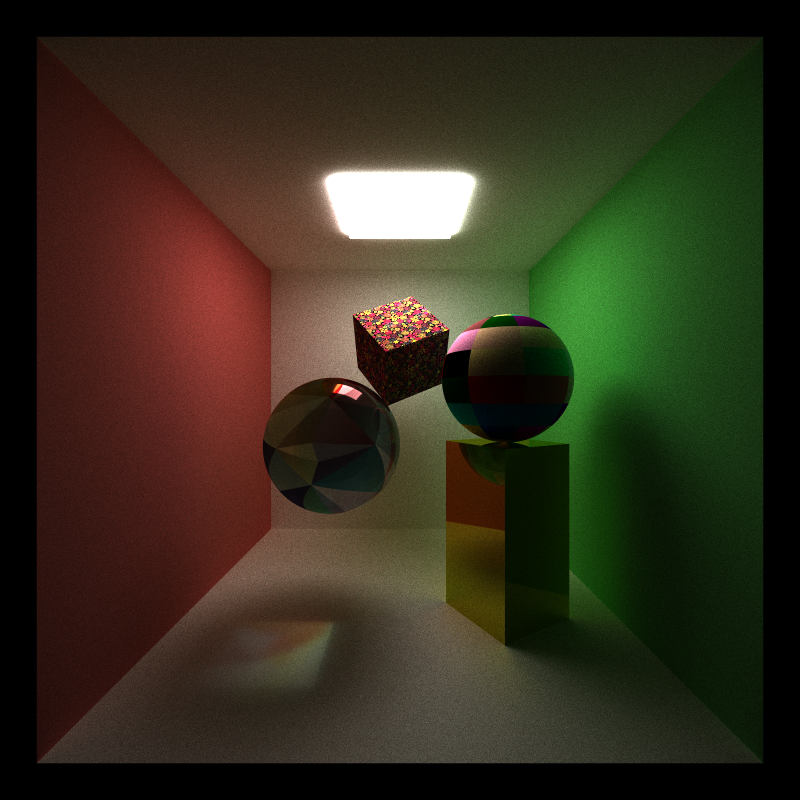

CUDA Path Tracer
================

**University of Pennsylvania, CIS 565: GPU Programming and Architecture, Project 3**

* Zimeng Yang
* Tested on: Windows 10, i7-4850 @ 2.3GHz 16GB, GT 750M (Personal Laptop)

## Roadmap
* [x] Basic 
  * [x] BSDF evaluation : diffuse, perfect specular and imperfect specular surface
  * [x] path termination using stream compaction
  * [x] toggleable method of sorting path/intersection continuous by material type
  * [x] toggleable method of using first bounce caching
* [ ] More on the way...
  * [x] Fresnel Refraction(Schlick's Approximation), Depth of Field and Stochastic AA
  * [x] Motion Blur
  * [x] Texture Mapping
  * [ ] Constructive Solid Geometry 
* [ ] ! performance anylasis for `reshuffleByMaterialIDs` and `useFirstBounceIntersectionCache`
* [ ] clean up readme, add reference.

## Overview


In this rendering, features include diffuse/reflective/refractive(Fresnel) materials, differently textured cube/sphere, motion blur(the shaking red cube) and Constructive Solid Geometry(not real).

For more renderings:

|without DOF | with DOF|
|------|------|
||| 

The textured refractive sphere is inside a CSG object, which is constructed by red cube difference green sphere. There are not one geometry. The caustic effect caused(projected) by textured sphere can also be captured well.

All features mentioned above can be modified in input file. See below. 

## Texture Mapping 
Implemention of cube and sphere UV coordinates mapping. 



Above rendering : Iterations = 5000, texture mapping for sphere and cube and for diffuse/specular materials.

For now, things can be done:
* Loading multiple texture files into GPU, calculate texture color while path tracing.
* Can be combined with different materials(reflect,refract and diffuse).
* Specify input texture file in input file, "NULL" means no texture.
* Use [stb_image](https://github.com/nothings/stb). The same thing as image class in framework.
```
....
REFRIOR     0
EMITTANCE   0
TEXTURE     texture_sphere.png
```

## Constructive Solid Geometry not yet
Reference : slides from CIS560 computer graphics.

**TEST basic ops correctness, low iterations**
* Basic TEST : A is a red cube, B is a green sphere. Hardcoded, to-do: build treREFRIOR     0
EMITTANCE   0
TEXTURE     NULLe.
* Test renderings: ~ 200 iterations.
* Build entire stucture in reference paper requires much longer time... don't know what to do with it

| A - B | B - A|
|------|------|
|||
 
|A Union B| A Intersect B|
|------|------|
|||

## Core Features
| transmission test (with AA)|
|----|
||
* Iterations: ~3300
* Test render for:
  * perfect transmission (right sphere): 1.0 refraction
  * weighted material (left sphere): 0.8 refraction + 0.1 reflection + 0.1 diffuse

|diffuse|perfect-specular and imperfect-specular|
|------|------|
|||
* Iterations: ~2000 
* sphere in right rendering is 0.5 reflectance combined with diffuse white [need better approximation]


## Stochastic Antialiasing & Depth of Field
### Fresnel Refraction using Schlick's Approximation
Implement a Fresnel Effect refraction evaluation using [Schlick's Approximation](https://en.wikipedia.org/wiki/Schlick%27s_approximation).
In the following rendering, right sphere is rendered using Fresnel refraction effect. Left sphere is rendered with 0.2 refraction + 0.1 reflection and 0.7 diffuse. Fresnel effect can better approximate the reflection contribution between two media.


### Depth of Field
|focal length = 10| focal length = 11.5|
|------|------|
|||


How to apply DOF in input file: modify property of camera like
```
...
DOF   1 10.5
```
First variable means len radius, second means focal length.


### Stochastic antialiasing:

|with AA| without AA|
|------|------|
|||

For the detail comparison:


## Motion Blur
|rotation + translation|scale + translation + non Motion Blur object|
|------|------|
|||

Motion blur was implemented by interpoalting between two postures. Translation, rotation and scale bluring can be applied separately or in combination with others. Input format: **[] means optional input**
```
// cube
OBJECT 6
cube
material 1
TRANS       2 4 0
ROTAT       0 0 0
SCALE       1 2 1
[TRANS_DST   x x x]
[SCALE_DST   y y y]
[ROTAT_DST   z z z] 
```
If TRANS_DST/SCALE_DST/ROTAT_DST are not specified, no motion blur will be appled in translation/scale/rotation.
Motion Blur is an effect for individual object, objects without any optional input will be rendered normally.

See `scenes/test_motion_blur.txt` for input details.

During interpolation, destination posture has higher possibility(10%) to be choosen. This will make the object look like ending up somewhere instead of floating all around.

Future : faster interpolation

## optimization?
