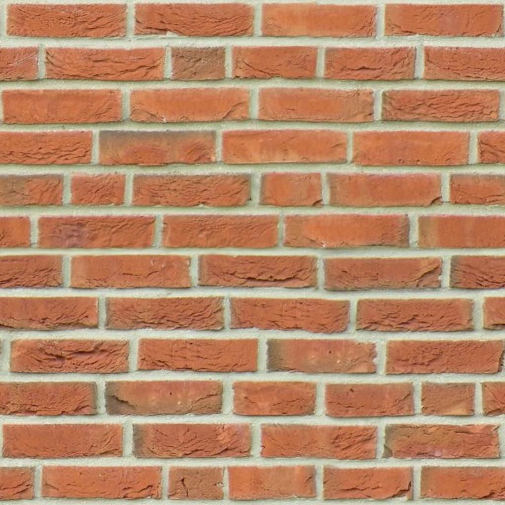

CUDA Path Tracer
================

**University of Pennsylvania, CIS 565: GPU Programming and Architecture, Project 3**

* Zimeng Yang
* Tested on: Windows 10, i7-4850 @ 2.3GHz 16GB, GT 750M (Personal Laptop)

## Roadmap
* [x] Basic 
  * [x] BSDF evaluation : diffuse, perfect specular and imperfect specular surface
  * [x] path termination using stream compaction
  * [x] toggleable method of sorting path/intersection continuous by material type
  * [x] toggleable method of using first bounce caching
* [ ] More on the way...
  * [x] Fresnel Refraction(Schlick's Approximation), Depth of Field and Stochastic AA
  * [x] Motion Blur
  * [x] Texture Mapping and Bump Mapping
  * [ ] Constructive Solid Geometry 
* [ ] ! performance anylasis for `reshuffleByMaterialIDs` and `useFirstBounceIntersectionCache`
* [ ] clean up readme, add reference.

## Overview


Above rendering is demonstrating features that include diffuse/reflective/refractive(Fresnel) materials, differently textured cube/sphere with normal mapping, motion blur(the shaking red cube) and Constructive Solid Geometry(not real, only basic ideas).
The textured refractive sphere is inside a CSG object, which is constructed by red cube difference green sphere. There are not one geometry. The caustic effect caused(projected) by textured sphere can also be captured well.

For more renderings:

|without DOF | with DOF|
|------|------|
||| 

|texture mapping only|texture and normal mapping|
|------|------|
|||

In above renderings, right image is for illustrating the effects of normal mapping. Left two spheres are only textured, right two spheres are textured and normal mapped.

All features mentioned above can be modified in input file. See below for details.  


## Basic Features
### Diffuse, Non Perfect Specular, Refraction and Weighted Material

| transmission test (with AA)|
|----|
||
* Iterations: ~3300
* Test render for:
  * perfect transmission (right sphere): 1.0 refraction
  * weighted material (left sphere): 0.8 refraction + 0.1 reflection + 0.1 diffuse

|diffuse|non perfect specular vs different specular exponents|
|------|------|
|||

In above rendering, right image is for demonstrating the influence of specular exponents. Three spheres, from left to right:
very high specular exponent (performs like a perfect specular), medium specular exponent and low specular exponent (performs more like a diffuse).

Reference link: http://http.developer.nvidia.com/GPUGems3/gpugems3_ch20.html
* Iterations: ~2000 
* Apply GPU Gem 3, Chpt 20 - Non perfect specular material approximation

### Comparison for Sort by Material ID and First Bounce Intersection Cache
Three options: `reshuffleByMaterialIDs`, `useFirstBounceIntersectionCache` and `stochasticAntialiasing` can be toggled in `scene->state` varialbe.

Test scene: `scenes/test_recording_time.txt`.

For following comparison, use ***opt_id*** for reshuffleByMaterialIDs, use ***opt_fbi*** for useFirstBounceIntersectionCache and use ***opt_aa*** for stochasticAntialiasing.

In following chart, only one optimization was applied for each test case. None means all three opts are false.


* sorting by material id: extremely slow. Sorting 640000(maximum) rays twice for each depth intersections? In this framework, path segments and intersections are separated as two arrays, which means either to sort them twice to make them relate to each other or combine them together. Either way will destroy the performance. So the framework is not working well this option and this option is useless.
* first bounce intersection cache: this option is not acceptable and applicable when applying anti-aliasing, AA is used for improving rendering quality with only small extra cost, which can be proved from the chart above. 
* stochastic antialising: use trivial cost and improve the rendering quality. Worth to do.


## Fresnel Refraction & Stochastic Antialiasing & Depth of Field
### Fresnel Refraction using Schlick's Approximation
Implement a Fresnel Effect refraction evaluation using [Schlick's Approximation](https://en.wikipedia.org/wiki/Schlick%27s_approximation).
In the following rendering, right sphere is rendered using Fresnel refraction effect. Left sphere is rendered with 0.2 refraction + 0.1 reflection and 0.7 diffuse. Fresnel effect can better approximate the reflection contribution between two media.


### Depth of Field
|focal length = 10| focal length = 11.5|
|------|------|
|||


How to apply DOF in input file: modify property of camera like
```
...
DOF   1 10.5
```
First variable means len radius, second means focal length.

### Stochastic antialiasing:

|with AA| without AA|
|------|------|
|||

For the detail comparison:


## Motion Blur
|rotation + translation|scale + translation + non Motion Blur object|
|------|------|
|||

Motion blur was implemented by interpoalting between two postures. Translation, rotation and scale bluring can be applied separately or in combination with others. Input format: **[] means optional input**
```
// cube
OBJECT 6
cube
material 1
TRANS       2 4 0
ROTAT       0 0 0
SCALE       1 2 1
[TRANS_DST   x x x]
[SCALE_DST   y y y]
[ROTAT_DST   z z z] 
```
If TRANS_DST/SCALE_DST/ROTAT_DST are not specified, no motion blur will be appled in translation/scale/rotation.
Motion Blur is an effect for individual object, objects without any optional input will be rendered normally.

See `scenes/test_motion_blur.txt` for input details.

During interpolation, destination posture has higher possibility(10%) to be choosen. This will make the object look like ending up somewhere instead of floating all around.

Future : faster interpolation


## Texture Mapping and Bump Mapping
Implemention of cube and sphere UV coordinates mapping and normal mapping. 

|texture mapping only|texture mapping and normal mapping|
|------|------|
|||

|texture 1|texture 2|normal map 1|normal map 2|
|------|------|------|------|
|||||

Above rendering : Iterations = 5000, texture mapping for sphere and cube and for diffuse/specular materials.
Normal mapping can enhance reality of renderings.

For now, things can be done:
* Loading multiple texture files into GPU, calculate texture color while path tracing.
* Can be combined with different materials(reflect,refract and diffuse).
* Specify input texture file in input file, "NULL" means no texture(or normal mapping texture).
* Use [stb_image](https://github.com/nothings/stb). The same thing as image class in framework.

Reference: pbrt and https://en.wikipedia.org/wiki/Bump_mapping.
```
....
REFRIOR     0
EMITTANCE   0
TEXTURE     texture_sphere.png
NORMAL_MAP  184.JPG
....
```

### Comparison Between File-loaded and Procedural Texture
For procedural texture, texture color is calculated intead of being read from texture file. I didn't implement a complex procedural texture computation function, I just followed the pbrt [10.5.2] and tried to implement checkerboard texture for sphere. And then I compared the averaged iteration time for these too:

|checkerboard texture = 165.34ms|file-loaded texture = 165.10ms|
|------|------|
|||

For this simple comparison, the calculation will have more performance impact than texture file I/O. For Complex procedural texture, it might reduce the performance.

But procedural texture has benefits like: infinite resolution, easily generating small texture. But file-loaded texture is able to load much more complex texture file.

Reference: https://en.wikipedia.org/wiki/Procedural_texture.

## Constructive Solid Geometry **not fully implemented**
Reference : slides from CIS560 computer graphics.

| A - B | B - A|
|------|------|
|||
 
|A Union B| A Intersect B|
|------|------|
|||
**Testing for basic ops correctness, low iterations.**
* Basic operations testings: A is a red cube, B is a green sphere. Hardcoded, to-do: build tree.
* Test renderings: ~ 200 iterations.
* Build entire stucture in reference paper requires much longer time... need to study the paper.


## Future: optimization
